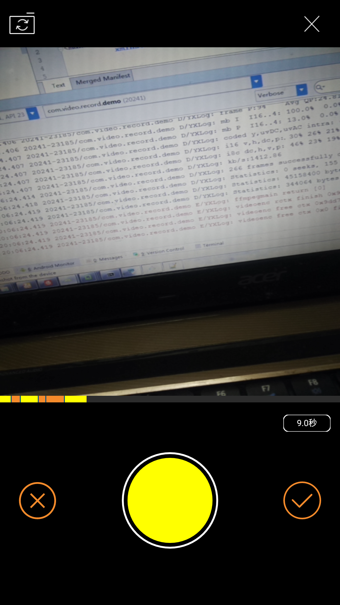

前言

参考项目：https://github.com/small-dream/VideoRecord.git

--
仿闲鱼的小视频拍摄 ，
	
	**增加：模拟闲鱼的ui效果**
	
	**改进：调用简单**
	
	**增加：多段录制**
	
	**增加：分段删除** 


效果图
---
  


使用
----
```
  compile project(':videorecord')
```

在Application中初始化，主要指定拍摄路径：

```
        VCamera.setVideoCachePath( Environment.getExternalStorageDirectory().getAbsolutePath() + "/videoRecord/");
        // 开启log输出,ffmpeg输出到logcat
        VCamera.setDebugMode(true);
        // 初始化拍摄SDK，必须
        VCamera.initialize(this);

```

**调用

```
    /**
     *
     * @param context
     * @param listener，OnFinishRecordingListener
     */
 MediaRecorderActivity.startActivity(this, this);
```

回调

```
  @Override
    public void onRecordFinished(final String path) {
        if (!TextUtils.isEmpty(path)) {
            mPreview.setImageBitmap(getVideoThumbnail(path));
            mPath.setText("路径： "+path);
           }
    }
```
